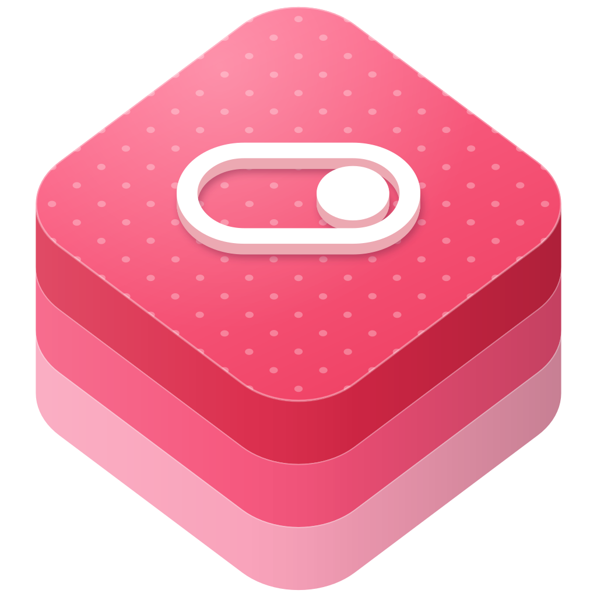

<p align="center">
  
</p>

<h1 align="center">swift-userdefault</h1>

<p align="center">
  A property wrapper that stores Swift values in UserDefaults.
</p>

<p align="center">
  <a href="https://github.com/swift-library/swift-userdefault/actions/workflows/ci.yml"></a>
  
  
  <a href="LICENSE.txt"></a>
</p>

[Overview](#overview) · [Install](#install) · [Quick start](#quick-start) ·
[Products](#products) · [Usage](#usage) · [Requirements](#requirements) ·
[Documentation](#documentation) · [Contributing](#contributing) ·
[License](#license)

> [!NOTE]
> swift-userdefault has no tagged release yet, so depend on the `master`
> branch. Changes on `master` may break source compatibility.

## Overview

swift-userdefault provides `@UserDefault`, a property wrapper that keeps a
property in `UserDefaults` under a key you choose. Reading the property returns
the stored value, or the declared default when the key holds no value of that
type. Assigning to the property writes the new value immediately. The wrapper
picks a storage format from the property's type, so numbers, enumerations, and
`Codable` models all use the same declaration.

- `Bool`, `Int`, `Float`, `Double`, and `String` values stored directly.
- `RawRepresentable` values, such as `String` or `Int` enumerations, stored as
  their raw values.
- `Codable` values stored as JSON-encoded `Data`.
- Optional properties that remove their key when you assign `nil`.
- Keys given as a `String` or as a `String`-backed enumeration.
- Any `UserDefaults` instance, with `.standard` as the default.

## Install

Add the package and the `UserDefault` product to `Package.swift`:

```swift
dependencies: [
  .package(
    url: "https://github.com/swift-library/swift-userdefault.git",
    branch: "master"
  ),
],
targets: [
  .target(
    name: "YourTarget",
    dependencies: [
      .product(name: "UserDefault", package: "swift-userdefault"),
    ]
  ),
]
```

swift-userdefault generates part of its source at build time with the
`GybPlugin` build tool plugin from
[swift-gyb](https://github.com/swift-library/swift-gyb), which SwiftPM resolves
as a dependency of swift-userdefault. Xcode asks you to trust the plugin the
first time it builds the package. To build with `xcodebuild` without that
prompt, pass `-skipPackagePluginValidation`.

## Quick start

Declare settings as properties, and read and write them like ordinary
properties:

```swift
import UserDefault

enum Theme: String {
  case light
  case dark
}

struct Account: Codable {
  var name: String
  var email: String
}

final class Settings {
  enum Keys: String {
    case launchCount
    case theme
    case account
  }

  @UserDefault(key: Keys.launchCount)
  var launchCount = 0

  @UserDefault(key: Keys.theme)
  var theme: Theme = .light

  @UserDefault(key: Keys.account)
  var account: Account? = nil
}

let settings = Settings()
settings.launchCount += 1
settings.theme = .dark
settings.account = Account(name: "Ada", email: "ada@example.com")

print(settings.theme) // dark
print(settings.account?.name ?? "signed out") // Ada
```

`launchCount` is stored as an integer, `theme` as the string `"dark"`, and
`account` as JSON data. The values persist across launches, so `launchCount`
keeps counting.

## Products

| Product | Use it for |
| --- | --- |
| `UserDefault` | The `@UserDefault` property wrapper, for most targets |
| `DynamicUserDefault` | The same modules built as a dynamic library |

Both products contain two modules. `UserDefault` defines the property wrapper.
`UserDefaultUtils` re-exports `UserDefault` and adds `RawRepresentable` support
for optionals.

## Usage

### Declaring properties

`@UserDefault` takes the key and, optionally, the `UserDefaults` instance to
use. The property's initial value is the default that reading returns until a
value is stored. The key can be a `String` or any `RawRepresentable` type whose
raw value is a `String`:

```swift
import Foundation
import UserDefault

final class SyncSettings {
  @UserDefault(key: "syncEnabled")
  var syncEnabled = true

  @UserDefault(
    key: "lastSyncInterval",
    userDefaults: UserDefaults(suiteName: "group.com.example.app") ?? .standard
  )
  var lastSyncInterval: Double = 0
}
```

The wrapper does not cache values. Every read and write goes through
`UserDefaults`, so a value that other code stores under the same key appears in
the property.

### Supported value types

The property's type selects how the value is stored:

- `Bool`, `Int`, `Float`, `Double`, and `String` values are stored as they are.
  If the stored value cannot be cast to the property's type, reading returns
  the default.
- `RawRepresentable` values are stored as their `rawValue`, which must be a
  property list type such as `String` or `Int`. A stored raw value that matches
  no case reads as the default.
- `Codable` values, including arrays and dictionaries of `Codable` elements,
  are encoded with `JSONEncoder` and stored as `Data`. If the key holds data
  that cannot be decoded as the property's type, or a value that is not data,
  reading returns the default. If a value cannot be encoded, for example a
  `Double.nan` inside a model, assigning it leaves the stored value unchanged.
  Debug builds stop at an assertion, so the mistake shows up during
  development.
- A type that is both `RawRepresentable` and `Codable`, such as
  `enum Mode: String, Codable`, is stored as its `rawValue`. Raw-value storage
  takes precedence over JSON, so adding `Codable` to an enumeration does not
  change how its values are stored.

Optionals of the directly stored types, such as `String?` and `Int?`, conform
to `Codable`, so they are stored as JSON data.

### Optional values

Assigning `nil` to an optional property removes its key from `UserDefaults`.
Reading the property then returns its default value, so a property declared
`= nil` reads `nil` again:

```swift
import UserDefault

final class Profile {
  @UserDefault(key: "nickname")
  var nickname: String? = nil
}

let profile = Profile()
profile.nickname = "Ada"
profile.nickname = nil // removes the "nickname" key
print(profile.nickname ?? "no nickname") // no nickname
```

A property with a non-`nil` default, such as `var nickname: String? = "Guest"`,
reads `"Guest"` after you assign `nil`.

### Optional enumerations

Import `UserDefaultUtils` to store an optional `RawRepresentable` value as its
raw value. The module makes `Optional` conform to `RawRepresentable` whenever
its wrapped type does, and it re-exports `UserDefault`:

```swift
import UserDefaultUtils

enum ComputeUnits: Int {
  case cpuOnly
  case cpuAndGPU
  case all
}

final class ModelSettings {
  @UserDefault(key: "computeUnits")
  var computeUnits: ComputeUnits? = .cpuOnly
}
```

Assigning `nil` removes the key, so `computeUnits` then reads `.cpuOnly`. A
stored raw value that matches no case also reads as the default.

Without `UserDefaultUtils`, an optional enumeration that is not `Codable` does
not compile as an `@UserDefault` property, and one that is `Codable` is stored
as JSON data.

## Requirements

- Swift 5.8 or later
- macOS 10.13 or later, iOS 11 or later, tvOS 11 or later, or watchOS 4 or
  later
- Python 3, available as `python3`, which the swift-gyb build tool plugin runs
  to generate source

## Documentation

- API reference: doc comments on `UserDefault`, its initializers, and
  `UserDefaultWrapper` describe each storage format and when reading returns
  the default value. In Xcode, choose Product > Build Documentation to browse
  them.
- [Changelog](CHANGELOG.md)

## Contributing

Read [CONTRIBUTING.md](CONTRIBUTING.md) before opening a pull request. This
project follows the [code of conduct](CODE_OF_CONDUCT.md).

## License

swift-userdefault is available under the Apache License 2.0 with the Swift
Runtime Library Exception. See [LICENSE.txt](LICENSE.txt).
